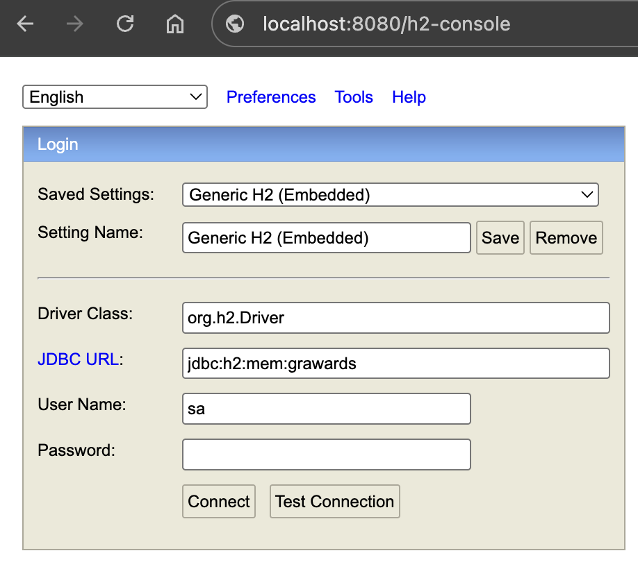

# 🏆 Golden Raspberry Awards - API 🏆

[](https://openjdk.java.net/projects/jdk/21/)
[](https://spring.io/projects/spring-boot)
[](https://maven.apache.org/)
[](LICENSE)
[](https://github.com/gabrielaugustin/golden-raspberry-awards-api)
[](https://github.com/gabrielaugustin/golden-raspberry-awards-api)

API REST para análise dos intervalos de prêmios dos produtores do Golden Raspberry Awards (Razzie Awards). Esta aplicação processa dados históricos dos prêmios e identifica os produtores com os maiores e menores intervalos entre vitórias consecutivas.

## 📋 Descrição

O Golden Raspberry Awards é um prêmio satírico que "homenageia" os piores filmes do ano. Esta API analisa os dados históricos dos prêmios para identificar:

- **Produtores com maior intervalo** entre vitórias consecutivas
- **Produtores com menor intervalo** entre vitórias consecutivas

A aplicação carrega automaticamente os dados de um arquivo CSV e disponibiliza endpoints para consulta dos intervalos de prêmios.

## 🛠️ Tecnologias Utilizadas

- **Java 21**
- **Spring Boot 3.5.3**
- **Spring Data JPA**
- **H2 Database** (banco em memória)
- **OpenCSV 5.11.2** (para processamento de CSV)
- **Lombok** (para redução de boilerplate)
- **Maven** (gerenciamento de dependências)

## 🚀 Como Executar

### Pré-requisitos

- Java 21 ou superior
- Maven 3.6+

### Executando a Aplicação

1. **Clone o repositório:** (usando HTTPS ou SSH)

   - _HTTPS:_

     ```bash
     git clone https://github.com/gabrielaugustin/golden-raspberry-awards-api.git
     cd golden-raspberry-awards-api
     ```

   - _SSH:_
     ```bash
     git clone git@github.com:gabrielaugustin/golden-raspberry-awards-api.git
     cd golden-raspberry-awards-api
     ```

2. **Execute com Maven:**

   ```bash
   ./mvnw spring-boot:run
   ```

3. **Ou compile e execute:**
   ```bash
   ./mvnw clean compile
   ./mvnw exec:java -Dexec.mainClass="com.augustin.gabriel.goldenraspberryawardsapi.GoldenRaspberryAwardsApiApplication"
   ```

A aplicação estará disponível em: **http://localhost:8080**

## 📊 Endpoints da API

### Health Check

- **GET** `/` - Status da aplicação
- **GET** `/health` - Status da aplicação

### Produtores

- **GET** `/producers/awards-intervals` - Retorna os intervalos de prêmios dos produtores
  - **Parâmetro opcional:** `limit` (padrão: 1) - Número de resultados para retornar

#### Exemplos de uso:

```bash
# Retorna o top 1 produtor com maior e menor intervalo
curl http://localhost:8080/producers/awards-intervals
```

```bash
# Retorna os top 3 produtores com maior e menor intervalo
curl http://localhost:8080/producers/awards-intervals?limit=3
```

```bash
# Retorna os top 10 produtores com maior e menor intervalo
curl http://localhost:8080/producers/awards-intervals?limit=10
```

#### Exemplos de resposta:

**Resposta padrão (limit=1):**

```json
{
  "min": [
    {
      "producer": "Joel Silver",
      "interval": 1,
      "previousWin": 1990,
      "followingWin": 1991
    }
  ],
  "max": [
    {
      "producer": "Matthew Vaughn",
      "interval": 13,
      "previousWin": 2002,
      "followingWin": 2015
    }
  ]
}
```

**Resposta com múltiplos resultados (limit=3):**

```json
{
  "min": [
    {
      "producer": "Joel Silver",
      "interval": 1,
      "previousWin": 1990,
      "followingWin": 1991
    },
    {
      "producer": "Bo Derek",
      "interval": 6,
      "previousWin": 1984,
      "followingWin": 1990
    },
    {
      "producer": "Buzz Feitshans",
      "interval": 7,
      "previousWin": 1985,
      "followingWin": 1992
    }
  ],
  "max": [
    {
      "producer": "Matthew Vaughn",
      "interval": 13,
      "previousWin": 2002,
      "followingWin": 2015
    },
    {
      "producer": "Bo Derek",
      "interval": 6,
      "previousWin": 1984,
      "followingWin": 1990
    },
    {
      "producer": "Buzz Feitshans",
      "interval": 7,
      "previousWin": 1985,
      "followingWin": 1992
    }
  ]
}
```

**Resposta quando não há dados suficientes:**

```json
{
  "min": [],
  "max": []
}
```

#### Casos de Erro:

**Parâmetro inválido:**

```bash
curl http://localhost:8080/producers/awards-intervals?limit=-1
```

**Resposta de erro:**

```json
{
  "error": "Invalid parameter",
  "message": "Page size must not be less than one",
  "status": "400"
}
```

## 🗄️ Banco de dados

As configurações para conexão do banco de dados podem ser encontrados em **_application.properties_**.

O schema para a criação das tabelas está localizado no arquivo _[src/main/resources/schema.sql](src/main/resources/schema.sql)_

Para conectar no banco de dados H2, é possível usar o console habilitado no projeto.

**Acesso ao console H2** (_Como na imagem em abaixo_)

- **Link:** [http://localhost:8080/h2-console](http://localhost:8080/h2-console)
- **JDBC URL:** jdbc:h2:mem:grawards
- **Usuário:** sa
- **Senha:**



## 📁 Carga de dados

**Atenção:** O sistema está utilizando o banco de dados H2 em memória, portanto todos os dados persistidos serão perdidos quando o sistema encerrar sua execução.

#### Localização da fonte dos dados

O arquivo CSV para carregar os dados no banco de dados está localizado em _[src/main/resources/data.csv](src/main/resources/data.csv)_.

#### Configurações adicionais

O caracter padrão usado para separação do dado do CSV é `;`. Se necessário, é possível configurar outro caracter usando a propriedade `csv.parser.separator-char`.

Por exemplo, para mudar o caracter para _vírgula_, adicione esta propriedade no arquivo **_application.properties_**: `csv.parser.separator-char=,`.

## 🏗️ Estrutura do Projeto

```
src/main/java/com/augustin/gabriel/goldenraspberryawardsapi/
├── configs/          # Configurações da aplicação
├── controllers/      # Controladores REST
├── dtos/             # Data Transfer Objects
├── entities/         # Entidades JPA
├── repositories/     # Repositórios de dados
├── services/         # Lógica de negócio
└── utils/            # Utilitários
```

## 📚 Especificações

As especificações do projeto estão no arquivo [docs/avaliacao-backend.pdf](docs/avaliacao-backend.pdf)

## 🧪 Testes

Para executar os testes:

```bash
./mvnw test
```

### Cobertura de Testes

O projeto possui uma cobertura abrangente de testes (apenas testes de integração, conforme especificado em documento):

- **32 testes** executados com sucesso
- **Testes de Integração**: Cobertura completa dos endpoints
- **Testes de Serviço**: Validação da lógica de negócio
- **Testes End-to-End**: Cenários completos de uso

#### Tipos de Teste Implementados:

1. **Testes de Integração**:

   - `ProducerControllerIntegrationTest` - Testa endpoints de produtores
   - `HealthControllerIntegrationTest` - Testa endpoints de health check
   - `EndToEndIntegrationTest` - Testa fluxos completos

2. **Testes de Serviço**:

   - `ProducerServiceIntegrationTest` - Testa lógica de cálculo de intervalos
   - `FilmServiceIntegrationTest` - Testa criação e manipulação de filmes
   - `StudioServiceIntegrationTest` - Testa operações com estúdios

3. **Testes de Carga de Dados**:
   - `DataLoaderServiceIntegrationTest` - Testa carregamento do CSV

## 👨‍💻 Desenvolvedor

- **Nome:** Gabriel Augustin
- **Email:** gabriel_augustin.tin@hotmail.com

---

**Nota:** Esta API foi desenvolvida como parte de uma avaliação técnica para análise de dados do Golden Raspberry Awards.
