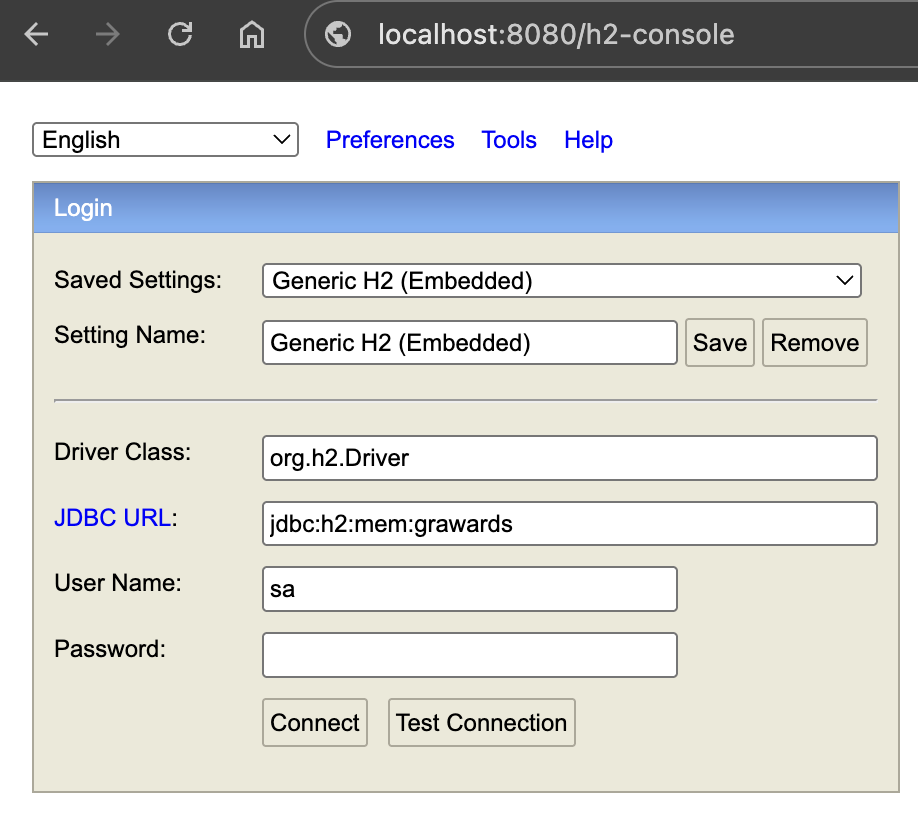

## Banco de dados

As configurações para conexão do banco de dados podem ser encontrados em **_application.properties_**.

O schema para a criação das tabelas está localizado no arquivo _[src/main/resources/schema.sql](src/main/resources/schema.sql)_

Para conectar no banco de dados H2, é possível usar o console habilitado no projeto.

**Acesso ao console H2** (_Como na imagem em abaixo_)
- **Link:** [http://localhost:8080/h2-console](http://localhost:8080/h2-console)
- **JDBC URL:** jdbc:h2:mem:grawards
- **Usuário:** sa
- **Senha:**

## Carga de dados

**Atenção:** O sistema está utilizando o banco de dados H2 em memória, portanto todos os dados persistidos serão perdidos quando o sistema encerrar sua execução.

#### Localização da fonte dos dados

O arquivo CSV para carregar os dados no banco de dados está localizado em _[src/main/resources/data.csv](src/main/resources/data.csv)_.

#### Configurações adicionais

O caracter padrão usado para separação do dado do CSV é `;`. Se necessário, é possível configurar outro caracter usando a propriedade `csv.parser.separator-char`.

Por exemplo, para mudar o caracter para _vírgula_, adicione esta propriedade no arquivo **_application.properties_**: `csv.parser.separator-char=,`.
